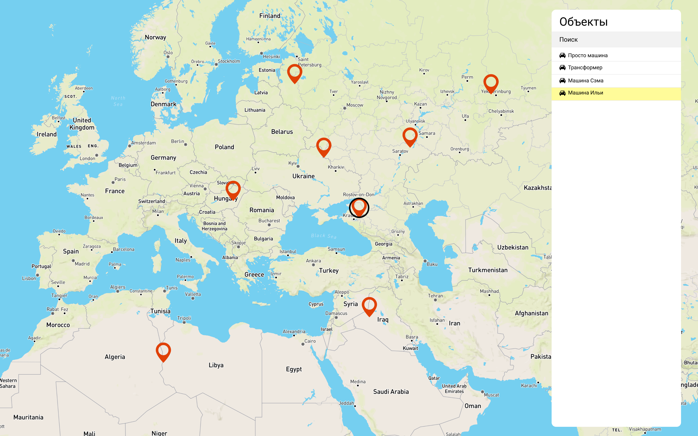

# Отображение объектов на карте 🗺️

Тестовое задание на позицию `frontend` разработчика.

## Задача

Реализовать приложение, в котором отображается карта с нанесенными на нее маркерами объектов из представленного ниже списка.
По нажатию на объект из списка он становится выбранным (появляется какой-то отличительный признак, например, подсветка его строки), 
вместе с этим карта [изменяет масштаб](https://leafletjs.com/reference-1.6.0.html#map-setzoom) до 10 уровня и центрируется на этом маркере.

Данные объектов доступны прямо в репозитории по [ссылке](https://raw.githubusercontent.com/waliot/test-tasks/master/assets/data/frontend-1-dataset.json).

Модель объекта следующая:

```ts
interface Object {
  id: number
  // Широта
  latitude: number
  // Долгота
  longitude: number
  // Имя
  name: string
}
```

## Требования

- TypeScript* / JavaScript

- Использование [Leaflet](https://leafletjs.com/)

### Дополнительно (будет преимуществом)

- Использование современного фреймворка: Angular* / React / Vue

- Реализация строки поиска (фильтрация списка с помощью поисковой фразы)

> Звездочкой (*) отмечены приоритетные технологии, с которыми Вам предстоит работать у нас в команде.

## Дизайн

Схематичный дизайн представлен ниже, делать точь-в-точь не обязательно!
Важнее архитектура проекта и организация кода, чем внешний вид.



_[Ссылка на Figma](https://www.figma.com/file/h0n3bPlbDcOBay3AQqcnGV/Frontend-design?node-id=0%3A1)_

## Решение

Решение должно быть представлено публичным репозиторием или zip-архивом. 
В проекте необходимо добавить `readme` с инструкцией по запуску приложения.
Результат решения (ссылку на репозиторий или zip-архив) следует отправить на почту по адресу: muratov.i@firstmk.ru.

Удачи! <3
