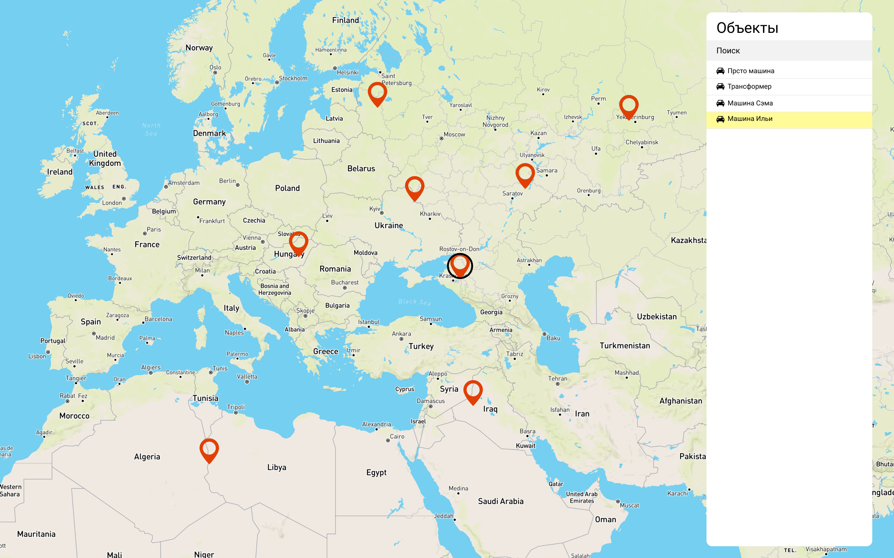

# Отрисовка маркеров на карте
### Тестовое задание на позицию Frontend разработчика

## Суть

Реализовать карту на которой будут отрисованы маркеры и список маркеров. Список маркеров будет запрашиваться прямо из репозитория в github. По нажатию на объект из списка он становится выбранным (появляется какой-то отличительный признак), вместе с этим карта [зумится](https://leafletjs.com/reference-1.6.0.html#map-setzoom)(до 10 уровня) и сдвигается до этого маркера на карте.

`https://raw.githubusercontent.com/waliot/test-tasks/master/db.json`

Список маркеров будет состоять из объектов интерфейс которых описан ниже

```ts
interface Marker {
  // Широта
  latitude: number
  // Долгота
  longitude: number
  id: number
  // Имя
  name: string
}
```

## Требования

- Использование [Leaflet](https://leafletjs.com/)
- JS/TS

### Будет преимуществом

- [Angular](https://angular.io/)
  
  Реализация приложения с использованием Angular

- Поиск

  Фильтрация списка с помощью поисковой фразы

## Дизайн

Схематичный дизайн ниже, делать точь в точь не обязательно.



_[Ссылка на Figma](https://www.figma.com/file/h0n3bPlbDcOBay3AQqcnGV/Frontend-design?node-id=0%3A1)_